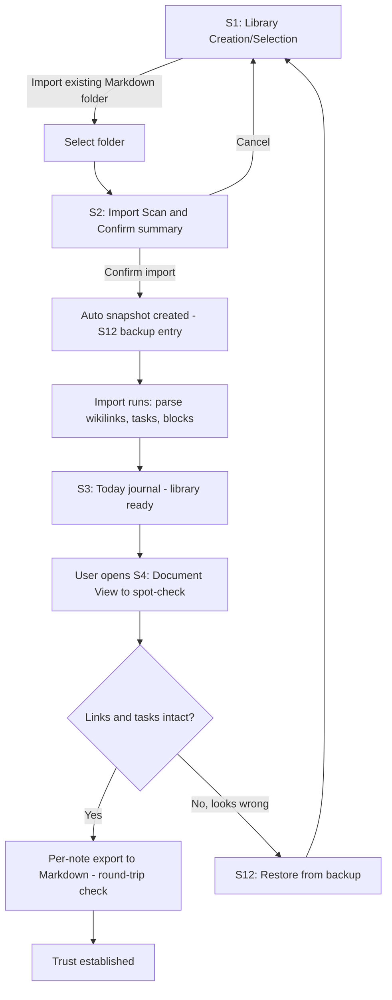
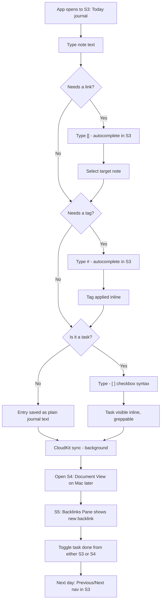
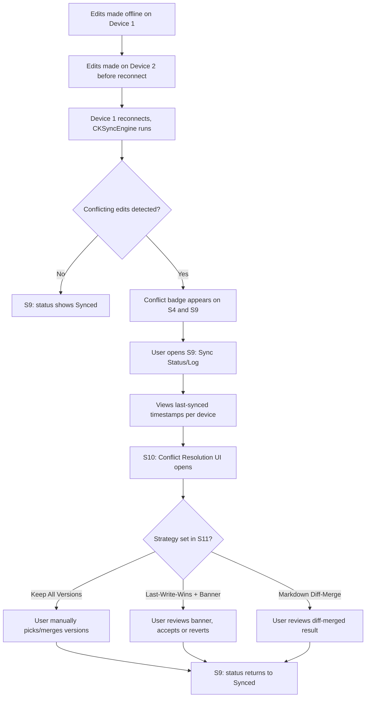
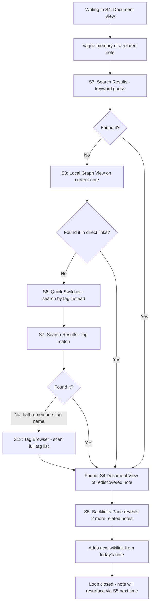
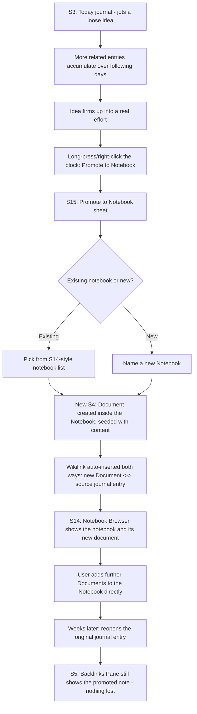
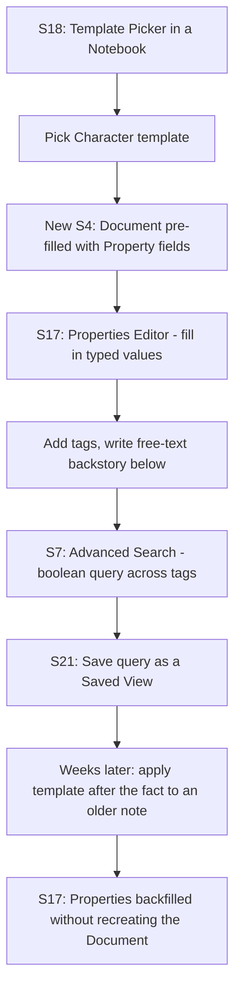
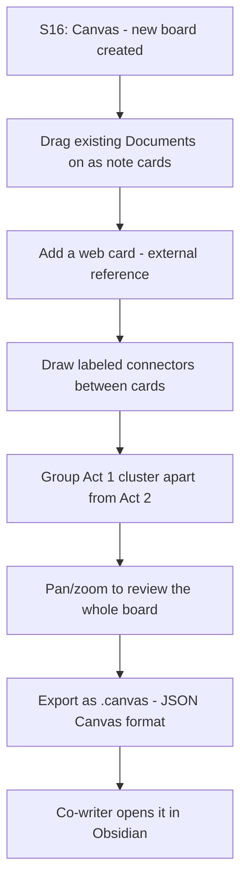
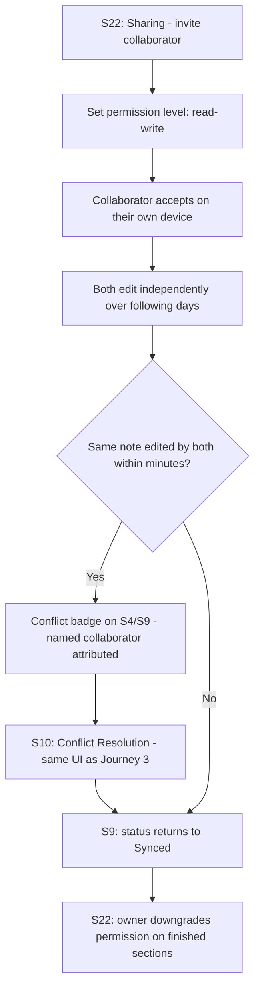
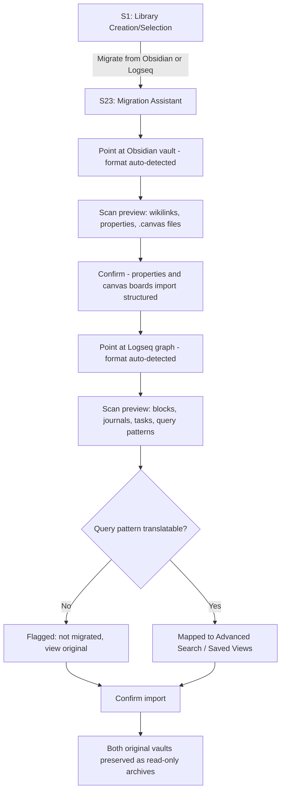

<!-- 04-InteractionDesign.md -->
<!--
  Part of the NoteBytez UIUX Research deliverable set. See ../../../NoteBytez20260813-UIUX-Research.md for scope/plan.
  Sitemap + userflow flowcharts for the 5 journeys in 02-Journeys.md. MVP scope only.
  Diagrams use Mermaid; every screen referenced here gets a wireframe on all 3 platforms in 05-Wireframes.md.
-->

# Interaction Design: Sitemap & Userflows

## Screen inventory (sitemap)

The information architecture is identical across platforms — same 15 screens, same relationships. What differs per platform is the navigation *container* (sidebar vs. tab bar vs. columns) and whether a screen is a full screen or a pane/sheet. That mapping is in the "Per-platform navigation shell" section below; the wireframes in [05-Wireframes.md](05-Wireframes.md) render each screen at full detail on all three platforms per the equal-coverage decision.

| # | Screen | Purpose | Reached from |
|---|---|---|---|
| S1 | Library Creation / Selection | First-run entry point; create new or import existing | App launch (no library yet) |
| S2 | Import Scan & Confirm | Preview what will be imported before committing | S1 → "Import existing Markdown folder" |
| S3 | Today (Journal) | Default landing screen; today's journal page | App launch (library exists), tab/sidebar |
| S4 | Document (Note) View | Read/edit any note; hosts Backlinks pane and inline tasks | Link tap, search result, Quick Switcher |
| S5 | Backlinks Pane | Shows linked/unlinked mentions for the open note | Docked in S4 (iPad/Mac) or sheet (iPhone) |
| S6 | Quick Switcher | Fast fuzzy note jump | Keyboard shortcut / search icon, any screen |
| S7 | Search Results | Full-text, tag, and path search results | S6 "search" mode, or dedicated search tab |
| S8 | Local Graph View | Current note + direct links | Graph icon in S4 toolbar |
| S9 | Sync Status / Log | Sync indicator detail, timestamps, errors, manual sync | Tap sync indicator (persistent chrome element) |
| S10 | Conflict Resolution | Strategy-specific UI: banner / diff / keep-all list | Triggered from S9 or a conflict badge on S4 |
| S11 | Settings — Conflict Strategy | Choose Keep All / Last-Write-Wins+Banner / Diff-Merge | Settings → Sync & Conflicts |
| S12 | Backup & Restore | List of snapshots, restore action | Settings → Backups |
| S13 | Tag Browser | List every tag in the library, jump to tagged notes | Tag chip tap (S3/S4/S7); Mac/iPad sidebar "Tags"; iPhone via Search tab's tag filter |
| S14 | Notebook Browser | List every notebook in the library, jump to its documents | "Notebooks" nav item (sidebar/tab) |
| S15 | Promote to Notebook | Choose an existing Notebook or name a new one to file a promoted journal block into | Long-press (iPhone/iPad) / right-click (Mac) a journal block in S3 → "Promote to Notebook" |
| S16 | Canvas | Infinite 2D board for spatial note/media/web card layout | Mac/iPad: dedicated sidebar item; iPhone: toolbar button on S14 (Notebook Browser) |
| S17 | Properties Editor | Typed field editor (text/number/date/checkbox/list), inline within a Document | Always visible atop S4's body when the Document has any Properties set |
| S18 | Template Picker / Manager | Choose a Note Template at creation; manage TemplateGroups in Settings | "New Document" inside a Notebook/Journal (Picker, sheet); Settings → Templates (Manager, pushed list) |
| S19 | Task Dashboard | Cross-note task list with status/date/tag filters, due-date/priority/recurrence indicators | Mac/iPad: dedicated sidebar item; iPhone: toolbar button on S3 (Today) |
| S20 | Attachment Preview | Inline thumbnails on a Document; tap for full-screen image/PDF preview | Toolbar `[📎]` glyph on S4 |
| S21 | Saved Views | Pinned list of saved search/task queries, always live | Mac/iPad: dedicated sidebar item; iPhone: a section atop S7 (Search) and S19 (Task Dashboard) |
| S22 | Sharing / Participants | Invite collaborators, set per-participant permission level | Library-level Settings → "Share" |
| S23 | Migration Assistant | Format-aware (Obsidian/Logseq) scan & confirm, extends S2 | S1 → "Migrate from Obsidian or Logseq" |
| S24 | Plugin Management | Install/enable/disable plugins; explicit per-plugin permission grants | Settings → Plugins (preview) |
| S25 | Graph Insights | Read-only answerable views: Orphans, Stale, Notes with Open Tasks, Hubs, Clusters | Mac/iPad/iPhone: "Insights" nav item, directly beneath Graph |
| S26 | Command Palette | Fuzzy-filtered jump to any destination or primary action (New Note, Sync Now, etc.) | ⌘P from any screen (Mac/iPad with keyboard); Explore Hub row (iPhone) |
| S27 | Explore Hub | iPhone-only list pushing to Graph/Insights/Tasks/Saved Views/Canvas/Tags/Command Palette | iPhone "Explore" tab (4th of 5) |

## Per-platform navigation shell

| Platform | Container | Primary nav | Notes |
|---|---|---|---|
| **Mac** | Multi-column window (NavigationSplitView) | Sidebar: Today, Notebooks, All Notes, Search, Tags, Graph, Settings | S4 + S5 side by side as two columns; S9 as a menu-bar-adjacent popover; S13/S14 as their own sidebar destinations; S15 as a sheet from S3; multiple windows supported |
| **iPad** | Collapsible sidebar + split view | Same sidebar as Mac, collapsible to overlay in portrait | S4 + S5 as split view in landscape, S5 becomes a sheet in portrait; S2/S12/S15 as modal sheets; S13/S14 as sidebar destinations |
| **iPhone** | Tab bar + stack navigation | Tabs: Today, Notebooks, Search, Graph, Settings | S4 is push-navigation full screen; S5, S6, S10, S15 are sheets/modals; S2 and S12 are rare but present as pushed screens under Settings; S13 has no dedicated tab — reached by pushing from the Search tab's tag filter or tapping a tag chip; S14 gets the tab (Notebooks is a peer of Journal, not a secondary index like Tags), bringing the tab bar to 5, still within Apple HIG's un-collapsed tab-bar limit |

### V1 additions to the navigation shell

The iPhone tab bar stays at 5 (Today, Notebooks, Search, Graph, Settings) — unchanged from MVP's own "still within Apple HIG's un-collapsed tab-bar limit" decision above. None of S16/S19/S21 get a 6th tab; each is reached by pushing from an existing tab instead, the same pattern S13 (Tags) already established.

| Platform | V1 additions |
|---|---|
| **Mac** | Sidebar gains Canvas (S16), Tasks (S19), and Saved Views (S21) as peer items alongside MVP's Today/Notebooks/All Notes/Search/Tags/Graph/Settings; S17 (Properties Editor) is inline within S4, not a separate column; S18/S22/S23 are sheets; S24 lives under Settings, alongside S11/S12 |
| **iPad** | Same three sidebar additions as Mac, collapsible; S17 inline in S4 same as Mac; S18/S20/S22/S23 as modal sheets, matching MVP's S2/S12/S15 pattern |
| **iPhone** | S16 reached via a toolbar button on S14 (Notebook Browser) rather than its own tab — `CanvasBoard` is library-scoped like Notebooks/Tags, not Notebook-owned, so this is a navigation shortcut, not a data relationship; S19 reached via a toolbar button on S3 (Today), matching how S9's sync glyph is a persistent-but-not-tabbed entry point; S21 folds into the top of S7 and S19 as a pinned section rather than its own screen; S17 inline in S4 same as other platforms; S18/S20/S22/S23 are sheets; S24 is a pushed screen under Settings |

### Flow Enhancements additions (`NoteBytez20260829v1-FlowEnhancements.md`)

The sidebar restructures into three labeled sections (Decision 2) rather than one flat list:
**Capture** (Today), **Library** (Notebooks, All Notes, Tags), **Explore** (Search, Graph,
Insights, Tasks, Saved Views, Canvas) — Settings renders outside any section. Graph is promoted
to a top-level Explore item on every platform; Insights sits directly beneath it. The iPhone tab
bar changes from `[Today, Notebooks, Search, Graph, Settings]` to
`[Today, Notebooks, Search, Explore, Settings]`, where **Explore** (S27) is a new hub list
pushing to every Explore-section destination (except Search, already its own tab) plus Tags.

| Platform | Flow Enhancements additions |
|---|---|
| **Mac** | Sidebar sectioned into Capture/Library/Explore + Settings; S25 (Insights) sits under Graph in the Explore section; S26 (Command Palette) opens via ⌘P as a floating sheet from any screen; a "Send to Canvas" toolbar action added to S8 (Graph View) and a swipe/context action on S25's cluster rows; S4's rendered body gains `!((anchor))` live-transclusion blocks (an addition to S4, not a new screen) |
| **iPad** | Same sectioned sidebar as Mac; S26 reachable via ⌘P with a hardware keyboard attached; same S8/S4 additions as Mac |
| **iPhone** | S25 reached via the Explore tab (S27) or pushed from Graph; S26 has no hardware-shortcut path, so it's a row in S27's list, and `TodayJournalView` keeps a toolbar Quick Switcher button as its own separate, pre-existing entry point; same S8/S4 additions as Mac |

### V2 Enhancements additions (`NoteBytez20260829v2-Enhancements.md`)

No new screens or nav-shell changes — every addition is a delta to an existing screen (S8, S4,
S16) or a new S26 palette entry.

| Platform | V2 Enhancements additions |
|---|---|
| **Mac** | S8 gains a Radial/Force mode picker + filter bar (Workstream A); S4's `!((anchor))` embed becomes editable in place rather than read-only (Workstream B); S16 gains "Bind to Note…"/"Unbind" (toolbar + board-list context menu) and a connector-creates-link confirm on a bound board (Workstream C); S26 (Command Palette) gains "Bind Current Canvas to a Note" and "Open Note as Bound Canvas" |
| **iPad** | Same S8/S4/S16/S26 additions as Mac |
| **iPhone** | Same S8/S4/S16 additions as Mac; the two new palette actions reach S26 the same way S25/S26 already do — via the Explore tab (S27) or S26 itself |

---

## Userflow: Journey 1 — Migrating a library (Mac-primary, present on all platforms)

---

## Userflow: Journey 2 — Daily capture → journal → link → task (iPhone-primary, present on all platforms)

---

## Userflow: Journey 3 — Sync status → conflict → resolved (all platforms equally)

---

## Userflow: Journey 4 — Exploring the graph to resurface a forgotten note (Mac-primary, present on all platforms)

---

## Userflow: Journey 5 — Capturing a loose idea, promoting it into a project notebook (iPhone-primary capture, Mac-primary organizing)

---

## Userflow: Journey 6 — Building a structured entity with Properties and a Note Template (Mac-primary)

---

## Userflow: Journey 7 — Laying out a plot on Canvas (Mac-primary, iPad secondary)

---

## Userflow: Journey 8 — Sharing a research space with a collaborator (Mac-primary)

---

## Userflow: Journey 9 — Migrating with the dedicated Migration Assistant (Mac-primary)

---

## Coverage check

Every screen (S1–S15) appears in at least one flowchart above. Every screen has an equal-detail wireframe on iPhone, iPad, and Mac in [05-Wireframes.md](05-Wireframes.md).

**Version 1:** S16–S24 appear in the Journey 6–9 flowcharts above, and each has an equal-detail wireframe on iPhone, iPad, and Mac in [05-Wireframes.md](05-Wireframes.md), same coverage bar as the MVP set.
